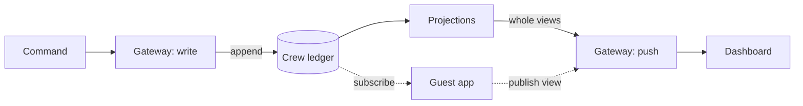
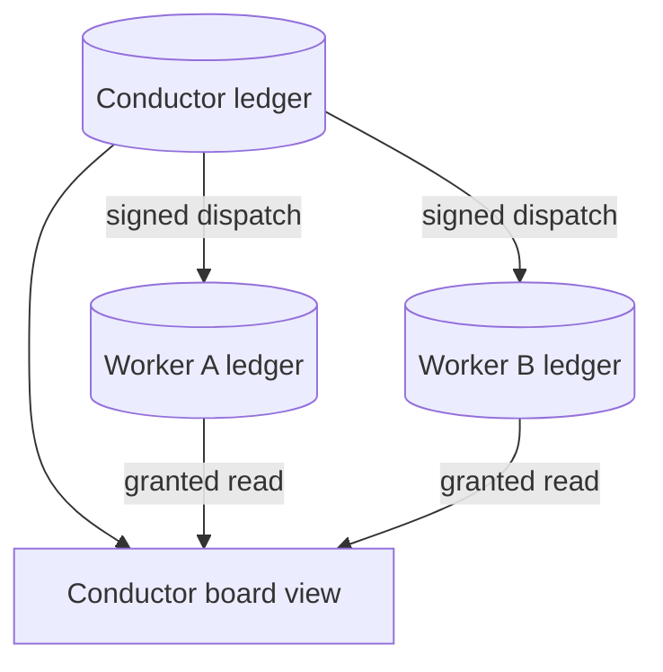

# RFC: Crew native with append only

How a crew keeps its state, how anyone reads it, and what happens when crews manage crews.

## 1. The one idea

Every crew keeps a ledger. Anything that happens to the crew is written as one line at the end of
that ledger: what happened, when, and which line number it is. Lines are never edited and never
deleted. That is the whole storage model.

Everything you see about a crew is derived from its ledger. "Is it starred", "what did it do
recently", "is it patrolling", "which sessions is it driving right now" are not stored anywhere. Each
one is a small program that reads the ledger from the first line to the last and keeps a running
answer. We call those programs projections and their answers views. Throw the views away and you
lose nothing: read the ledger again and you get the same views back.

So there are two kinds of things, and the difference matters everywhere below:

- Events: facts about the past. Written once. The ledger is the only place they live.
- Views: the current answer to a question. Computed, cached, pushed, disposable.

The dashboard never reads events. It receives views, whole, and paints them. When a view changes
the gateway pushes the new one and the page swaps it in. That is why a star toggled from another tab
lights up without a refresh, and why the page fetches the roster exactly once.

The solid path is the gateway's own. The dotted path is a guest (section 4): it reads the same
ledger, computes in its own process, and hands back a view that travels the same way.

## 2. What "per crew" means

One ledger per crew, as one file: `members/<crew>/log.jsonl`. The first line names the crew and the
ledger format version. Every later line is one event with a sequence number that counts up by one.

The gateway is the only process that writes to a ledger. It writes a line, flushes it to disk, and
only then tells anyone about it. If the machine dies mid-write, the torn last line is dropped on the
next start; a hole anywhere before that is treated as corruption and the crew is reported, not
silently repaired. A ledger is never rewritten to "fix" it.

Not everything is an event. Whether a crew is running right now, and which live sessions it is
driving, are presence: they come from the process that is alive and go away when it is not. Presence
is read live and joined into the view at render time. Recording "started" in a ledger without a
matching "stopped" is how you end up showing a patrol as armed after a restart killed it, so the
ledger loader writes the closing line itself when it finds an opener with no closer.

Nine crews on the Members page means nine ledgers. They share nothing.

## 3. The rules, and why each exists

These came out of the pilot as the load-bearing rules. Break one and a specific bug comes back.

1. Header first. The first line identifies the crew and the format. A reader that sees no header
   refuses the file instead of guessing.
2. Sequence numbers are contiguous. `seq` is the line's position after the header. A reader that
   receives seq 41 after seq 39 does not "fold across the gap"; it drops its view and re-reads from
   39. A gap means it missed something and its answer is now wrong.
3. One writer per ledger. Two writers would both claim the next seq. Everything routes through the
   gateway.
4. Flush before announce. A line is durable before any subscriber hears of it, so a view can never
   be ahead of the disk.
5. Same object, no event. Saving a configuration that changes nothing appends nothing. Otherwise the
   ledger fills with noise and "when did this change" stops meaning anything.
6. Subscribe first, then load the baseline. The client opens its subscription before it fetches
   the current views, so a change that lands between the two is delivered rather than lost.
7. Views travel whole. A pushed view replaces the old one entirely; there is no client-side merging.
   Higher seq wins; an older frame arriving late is ignored.
8. Reconnect is truncate then reseed. On reconnect the client throws away anything newer than the
   last seq the server confirms and reloads. Rows past that seq rode state a restart lost.
9. Closers are synthesized at load, and written. If the ledger ends with "patrol started" and the
   process is gone, the loader appends "patrol stopped, reason interrupted" once, so the next load
   does not have to decide again.
10. Never rewrite the ledger. Not for migration, not for cleanup, not for privacy. New facts are new
    lines. A view that should forget something is a projection that skips it.

## 4. Guests in a crew's ledger

A crew's ledger is about the crew, but the crew is not the only one with something to say about it.
An app might compute a statistic for it, a patrol might record what it found, a hosted plugin might
publish a view. These are guests. A guest may:

- read the ledger, by subscription, from a seq it names;
- append events, but only under its own name: an app called `stats` may write `stats/computed`,
  never `member/config`;
- publish a view under its own name, which the gateway pushes exactly like a built-in one and the
  drawer renders as a card.

Guests declare what they intend to do in their manifest, and the gateway checks the declaration on
every call, not at install time. An uninstalled guest has its views withdrawn; its events stay,
because they happened. A guest computes its view in its own process: the gateway never runs guest
code, so a guest can be written in any language and can crash without taking the gateway with it.

The ledger still belongs to the crew. The guest signs its lines.

## 5. Crews that manage crews

Now the hard question. A conductor crew runs five worker crews. The conductor needs to know what its
workers did; the workers need to know what they were told. If the tree "shares one ledger", two
things go wrong at once. Any crew that ever connects to another joins its ledger for good, so every
tree eventually becomes one tree, and one global ledger is exactly the design we chose not to copy.
And permission collapses to per-line access control on a shared stream, which nobody gets right.

The answer is to keep three things separate that the question runs together:

- Storage follows the subject. Each crew has its own ledger, always. A conductor does not write
  into a worker's ledger by right of being its parent; nobody does.
- Visibility follows grants. Reading someone else's ledger is a subscription that a grant allows.
  Grants are recorded, checked on every read, and revocable.
- The tree is a view. There is no tree in storage. "Who reports to whom" is a projection over
  attach events, and "how are my workers doing" is a projection that joins several ledgers.

Concretely:

Attaching is an event in both ledgers. When the conductor takes on a worker, the conductor's ledger
gets `crew/child-attached {child}` and the worker's ledger gets `crew/parent-attached {parent}`.
The two lines are the authorization: from them the gateway derives that the conductor may read the
worker's ledger. Detach writes the mirror pair and the grant ends. The tree projection is folded
from these lines, so a worker can report to two conductors, or move between them, without any
ledger moving.

Directing a worker is a guest append. The conductor writes into the worker's ledger the way an app
would, under its own name: `crew:conductor/dispatch {item}`. The worker's ledger is therefore the
complete record of what the worker was asked to do, in order, next to what it did. The conductor's
own ledger records `crew/dispatched {child, seq}`, a pointer to the line it wrote in the child. Both
ledgers stay self-contained; a cross-reference is a (crew, seq) pair.

The conductor's board is a multi-source view. Its projection subscribes to its own ledger and to
each worker's, with the contiguity rule applied per source. The view's version is not one seq but
one per source, `{self: 12, worker-a: 40, worker-b: 7}`; the baseline carries the same map and a
reconnect truncates per source. Pushing it works unchanged: it is still a whole value with a version
that only goes up.

Three ledgers, none shared. The downward arrows are guest appends signed by the conductor; the
arrows into the view are reads that the attach events authorize.

Readers understand each other because event names are global. `member/config` means the same thing
in every ledger. A conductor can fold a worker's ledger because the vocabulary is shared, not
because the storage is. Sharing the dictionary is what "a tree can read itself" actually requires;
sharing the notebook is not.

Two alternatives, and why not:

- One global ledger. Every consumer scans everything; retention, quota and blast radius cannot be
  per crew; permission becomes per-line access control on a shared stream. It is the simplest thing
  for one user on one machine and the wrong thing the moment there are two kinds of reader.
- One ledger per tree. Re-parenting a crew means moving or splitting a ledger; a crew with two
  supervisors cannot exist; and it is the global ledger arriving slowly, since trees merge whenever
  anything connects.

## 6. Who may see what

Grants say which ledgers a reader may subscribe to. Some lines inside a permitted ledger still
should not reach some readers: a crew's bindings, a message preview, a patrol's reason. Two rules,
in order of preference:

First, do not put it in the event. An event points at the durable store that holds the sensitive
thing; the store has its own access control. This covers most cases and costs nothing.

Second, give each event type a visibility class, declared once in the vocabulary: `public` for any
reader granted the ledger, `tree` for the crew and its ancestors, `owner` for the crew's own
projections and the operator only. The gateway filters a subscription by the reader's class. To keep
rule 2 (contiguous seq) intact, a filtered line is delivered as a tombstone, `{seq, type:
"_withheld"}`, so the reader knows a line existed and folds nothing from it. A tombstone leaks that
something happened and when; for a type where even that is too much, the reader is not granted the
ledger at all.

Classes are per type, not per line. Per-line access control is the thing this design exists to
avoid.

## 7. What exists today and what does not

Built and running: one ledger per crew, the ten rules, four built-in projections, whole-value push
([`member-event-log.md`](../system-specs/modules/member-event-log.md)); guests (read, namespaced
append, published views, teardown) under
[`contribution-protocol.md`](../system-specs/modules/contribution-protocol.md); a hosted foreign
plugin publishing a view; and a converter that installs configuration-only plugin bundles as apps
([`plugin-import.md`](../system-specs/modules/plugin-import.md), with the mapping in
[`harness-plugin-mapping.md`](../system-specs/modules/harness-plugin-mapping.md)).

Not built: attach and dispatch events, grants derived from them, the multi-source tree view,
visibility classes and tombstones, and any ledger kind other than crew. The next kind is the
session, whose events (turns, steps, model timing) are what most plugins actually want to fold. The
one after is the app's own ledger, for apps whose facts are about themselves rather than about a
crew.
